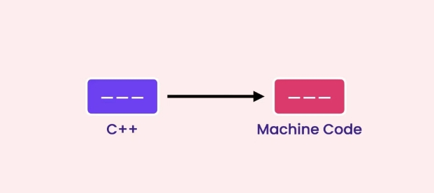

[TOC]


# c++

从C学到C++, 头皮发麻，一句“C++基本和C语言差不多”，一本谭浩强老师的C语言直接给我送走，看了网上一个大佬推荐的《C++ Primer Plus》，果断买了一本，买完就后悔了------真是厚，网上找个一个视频，说是MOSH大佬的，看了强者发型直接开学，一边学习一边记录，加油！！！撑下去。

## 课程结构

- **基础（BASICS）**
  - C++基础(Fundamentals of programming in C++)
  - 数据类型(Data types)
  - 决策语句(Decision making statements)
  - 循环(Loops)
  - Functions(函数)
- **中级（INTERMEDIATE）**
  - 数组(Arrays)
  - 指针(Pointers)
  - 字符串(Strings)
  - 结构体(Structures)
  - 枚举(Enumerations)
  - 流(Streams)
- **高级（ADVANCED)**
  - 类(Classes)
  - 异常(Exceptions)
  - 模板(Templates)
  - 容器(Containers)

## C++基础

### Part1---C++基本内容

#### 1. C++介绍(一种编程语言)

- 用于构建性能关键型应用程序
- 做游戏
- 设备驱动程序
- 浏览器
- 服务器
- 操作系统

#### 2. 学习内容

- 语言本身 (语法)
- 标准模板库 (算法 + 数据结构)

#### 3. 集成开发环境(Integrated Development Environment)

- MS Visual Studio
- XCode
- CLion
- DEV C++

#### 4. 第一个C++程序

```c++
#include <iostream>

int main(){
  std::cout << "Hello World!";
  return 0;
}
```

- iostream : input output stream
- std:: 有点类似于一个容器
- return 0;  告诉操作系统正常结束程序

#### 5. 开始编译运行

##### ① 、C++代码转换为机器码



#### 6. 变量和常量(Variables and constants)

##### ①、变量

- 变量在内存中的存储
- 
- 声明并初始化变量

```c++
int file_size = ;
int counter = 0;
double sales = 9.99;
```

- 练习 ：交换两个变量的值(swap the value of two variables)

  - ```c++
    int a = 4;
    int b = 5;
    cout << "a : " << a << endl;
    cout << "b : " << b << endl;
    int temp = a;
    a = b;
    b = temp;
    cout << "a : " << a << endl;
    cout << "b : " << b << endl;
    ```

  - ```c++
    int a = 4;
    int b = 5;
    cout << "a : " << a << endl;
    cout << "b : " << b << endl;
    swap(a, b);
    cout << "a : " << a << endl;
    cout << "b : " << b << endl;
    ```

##### ②、常量

不能改变的东西称为常量， 使用const关键字约束

```c++
const double pi = 3.14;
```

#### 7. 命名约定(Naming conventions)

  ```c++
int file_size;  // Snake Case
int FileSize;   // Pascal Case
int fileSize;   // Camel Case
int iFileSize;  // Hungarian Notation
  ```

#### 8. 数学表达式(Mathematical expressions)

```c++
// 数学表达式
int m = 10 + 3;
int a = 10 - 3;
int n = 10 * 3;
int n = 10 / 3;     // 除法只会返回整数  结果为3
int e = 10 % 3;     // 模除 会求出余数   结果为1
m = m + 1;
m++;                // 后缀++ : 先做赋值操作
++x                 // 前缀++ ：先做加一操作
```

注意理解前缀++和后缀++的区别

#### 9. 从控制台读取和写入(Writing to and reading from the console)

```c++
// 声明一个变量
int number = 1;

// 在控制台输出内容
cout << "x=" << x  << endl;  // endl 表示换行

// 从控制台读入数据
cin >> number;
```

#### 10. 使用标准库(Working with the standard library)

```c++
#include <cmath>

double result = floor(1.2);  // 向下取整
cout << result;              // 1
result = pow(2, 3);          // 求幂次的函数
cout << result;              // 8
```

#### 11. 注释(Comments)

注释应该表示why 和 how

```c++
// 这是一个单行注释
/*
	我是一个多行注释

*/
```

### Part2---C++基础数据类型

- 静态类型(Statically-Typed)
  - C++
  - C#
  - Java
- 动态类型(Dynamically-Typed)
  - Python
  - Javascript
  - Ruby

#### 1. 内置类型(Built-in type)

|    Type     | Bytes |        Range         |
| :---------: | :---: | :------------------: |
|    short    |   2   |   -32768 to 32768    |
|     int     |   4   |      -2B to 2B       |
|    long     |   4   |         Same         |
|  long long  |   8   |                      |
|    float    |   4   |  -3.4E38 to 3.4E38   |
|   double    |   8   | -1.7E308 to 1.7E308  |
| long double |   8   | -3.4E932 to 1.7E4832 |
|    bool     |   1   |      true/false      |
|    char     |   1   |                      |

##### ①、初始化变量

```c++
// 数据类型
int age = 18;                  // 整型
double price = 9.99;           // 双精度浮点数
float interestRate = 3.67F;    // 单精度浮点数
long fileSize = 90000L;        // 长整型
char letter = 'a';             // 字符型
string name = "Wzs";           // 字符串
bool isValid = true;           // 布尔类型
auto years = 5;                // 自动识别数据类型 (C++11及以后支持)
int number {};
```

#### 2. 数字系统(Number Systems)

```c++
int x = 255;                   // 十进制数
int y = 0b111111;              // 二进制数
int z = 0xFF;                  // 十六进制数
unsigned int number = 255;     // 不能读入负数，使用很少
```

##### ① 随机数 

```c++
#include <cstdlib>
#include <ctime>

srand(time(nullptr));    // time()函数会返回Jan 1 1970到现在的秒数
int number = [rand() % (max - min + 1)] + min;
cout << number;
```

##### ② 格式化输出

```c++
#include <iomanip>

cout << setw(10) << "Spring" << setw(10) << "Nice" << endl
     << "Summer" << "Hot";

cout << left << setw(10) << "Spring" << setw(10) << "Nice" << endl
     << "Summer" << "Hot";

cout << fixed << setprecision(2) << 12.34567;  // 保留两位小数
```

##### ③ 数据类型占据空间和范围

```c++
int bytes = sizeof(int);
int min = numeric_limits<int>::min();  // int 类型所能存储最小值
int max = numeric_limits<int>::max();  // int 类型所能存储最大值
```

#### 3. 布尔类型(Boolean values)

```c++
bool isNewUser = false;
cout << boolalpha << isNewUser;
```

#### 4. 字符与字符串(Characters and strings)

```c++
char ch = 'a';
cout << ch;
cout << +ch;   // 打印ascii

string name = "Zesheng";
cout << name;
cin >> name;    // 不能读入空格
getline(cin, name);   // 读入包含有空格的字符串
cout << name;
```

#### 5. 数组(Arrays)

```c++
int numbers[] = {1, 2, 3};
cout << numbers[0];          // 理解数组下标从零开始即可
```

#### 6. 类型转换(Type Conversion)

```c++
// C语言风格的数据类型转换
double a = 2.0;
int b = (int) a;

// C++风格的数据类型转换
int c = static_cast<int>(a);
```

### Part3---C++比较运算

#### 1. 比较运算符(Comparison operators)

```c++
bool a = 10 > 5;
bool b = 10 == 10;
bool c = 10 != 5;
```

#### 2. 逻辑运算符(Logical operators)

```c++
bool d = a && b;               // 逻辑与  --->  左右同时为真，结果为真
bool e = a || b;               // 逻辑或  --->  左右一边为真，结果为真
bool f = !a;                   // 逻辑非  --->  真变假，假变真
```

#### 3. if语句

```c++
if (temperature < 60){
  // ...
}
else if (temperature < 90){
  // ...
}
else{
  // ...
}
```

#### 4. switch语句

```c++
switch (menu){
  case 1:
    // ...
    break;
  case 2:
    // ...
    break;
  // ...
  default:
    // ...
}
```

#### 5. 条件运算符(Conditional operator)

```c++
double commission = (sales < 10'000) ? .05 : .1;
```

### Part4---C++循环结构

#### 1. for循环(For loops)

```c++
for (int i = 0; i < 5; i++)
  	cout << i;
```

#### 2. 基于范围的for循环(Range-based for loops)

```c++
int numbers[] = {1, 2, 3};
for (int number: numbers)
  	cout << number << endl;
```

#### 3. while循环

```c++
int i = 0;
while (i < 5){
  cout << i << endl;
  i++;
}
```

#### 4. Do-while循环

```c++
int i = 0;
do{
  cout << i << endl;
  i++;
}while (i < 5);
```

#### 5. Break 和 Continue关键字

```c++
break: 打断循环
continue: 结束本次循环，进行下一次循环
```

### Part5---C++函数

#### 1. 定义和调用函数(Define and call functions)

```c++
// 无返回值的函数
void greet(string name){
	cout << "Hello " << name;
}

// 有返回值的函数
string fullName(string firstName, string lastName){
    return firstName + " " + lastName;
}
```

#### 2. 使用默认值参数(Assign parameters a default value)

```c++
double calculateTax(double income, double taxRate = .2){
    return income * taxRate;
}
```

#### 3. 重载函数(Overload functions)

```c++
void greet(string name){
    cout << "Hello " << name;
}

void greet(string title, string name){
    cout << "Hello " << title << " " << name; 
}
```

#### 4. 引用传参(Pass arguments by value or reference)

```c++
void incresePrice(double &price){
    price *= 1.2;
}
```

#### 5. 函数声明

```c++
void greet(string name);
```

#### 6. 全局变量和局部变量(Local vsglobal variables)

```c++
// Global variable(global scope)
// 一般来讲定义为常量
const double taxRate = .2;

double calculateTax(int sales){
  return sales * taxRate;
}

int main(){
  // Local variable (local scope)
  int sales = 10'000;
  double tax = calculateTax(sales);
  cout << tax;
}
```

#### 7. 定义命名空间

```c++
namespace messaging{
  	void greet(string name){}
}
```

#### 8. 使用命名空间

```c++
using namespace messaging
// or
using messaging::greet;
```

#### 9. 组织函数到不同的文件(Organize functions in different files)

**main.cpp:**

```c++
#include <iostream>
#include "utils/greet.hpp"
using namespace std;

int main(){
  greet("Zesheng");
}
```

**utils/greet.cpp**

```c++
#include <iostream>
using namespace std;

// Function definition
void greet(string name){
  cout << "Hello " << name;
}
```

**utils/greet.hpp**

```c++
#ifndef UTILS_GREET
#define UTILS_GREET

#include <string>
// Function declaration(function prototype)
void greet(std::string name);

#endif
```