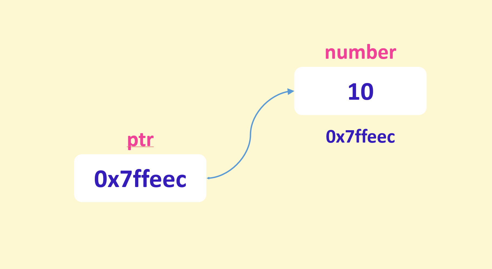

[TOC]


# c++

从C学到C++, 头皮发麻，一句“C++基本和C语言差不多”，一本谭浩强老师的C语言直接给我送走，看了网上一个大佬推荐的《C++ Primer Plus》，果断买了一本，买完就后悔了------真是厚，网上找个一个视频，说是MOSH大佬的，看了强者发型直接开学，一边学习一边记录，加油！！！撑下去。

## 课程结构

- **基础（BASICS）**
  - C++基础(Fundamentals of programming in C++)
  - 数据类型(Data types)
  - 决策语句(Decision making statements)
  - 循环(Loops)
  - Functions(函数)
- **中级（INTERMEDIATE）**
  - 数组(Arrays)
  - 指针(Pointers)
  - 字符串(Strings)
  - 结构体(Structures)
  - 枚举(Enumerations)
  - 流(Streams)
- **高级（ADVANCED)**
  - 类(Classes)
  - 异常(Exceptions)
  - 模板(Templates)
  - 容器(Containers)

## C++基础

### Part1---C++基本内容

#### 1. C++介绍(一种编程语言)

- 用于构建性能关键型应用程序
- 做游戏
- 设备驱动程序
- 浏览器
- 服务器
- 操作系统

#### 2. 学习内容

- 语言本身 (语法)
- 标准模板库 (算法 + 数据结构)

#### 3. 集成开发环境(Integrated Development Environment)

- MS Visual Studio
- XCode
- CLion
- DEV C++

#### 4. 第一个C++程序

```c++
#include <iostream>

int main(){
  std::cout << "Hello World!";
  return 0;
}
```

- iostream : input output stream
- std:: 有点类似于一个容器
- return 0;  告诉操作系统正常结束程序

#### 5. 开始编译运行

##### ① 、C++代码转换为机器码


#### 6. 变量和常量(Variables and constants)

##### ①、变量

- 变量在内存中的存储
- 
- 声明并初始化变量

```c++
int file_size = ;
int counter = 0;
double sales = 9.99;
```

- 练习 ：交换两个变量的值(swap the value of two variables)

  - ```c++
    int a = 4;
    int b = 5;
    cout << "a : " << a << endl;
    cout << "b : " << b << endl;
    int temp = a;
    a = b;
    b = temp;
    cout << "a : " << a << endl;
    cout << "b : " << b << endl;
    ```

  - ```c++
    int a = 4;
    int b = 5;
    cout << "a : " << a << endl;
    cout << "b : " << b << endl;
    swap(a, b);
    cout << "a : " << a << endl;
    cout << "b : " << b << endl;
    ```

##### ②、常量

不能改变的东西称为常量， 使用const关键字约束

```c++
const double pi = 3.14;
```

#### 7. 命名约定(Naming conventions)

  ```c++
int file_size;  // Snake Case
int FileSize;   // Pascal Case
int fileSize;   // Camel Case
int iFileSize;  // Hungarian Notation
  ```

#### 8. 数学表达式(Mathematical expressions)

```c++
// 数学表达式
int m = 10 + 3;
int a = 10 - 3;
int n = 10 * 3;
int n = 10 / 3;     // 除法只会返回整数  结果为3
int e = 10 % 3;     // 模除 会求出余数   结果为1
m = m + 1;
m++;                // 后缀++ : 先做赋值操作
++x                 // 前缀++ ：先做加一操作
```

注意理解前缀++和后缀++的区别

#### 9. 从控制台读取和写入(Writing to and reading from the console)

```c++
// 声明一个变量
int number = 1;

// 在控制台输出内容
cout << "x=" << x  << endl;  // endl 表示换行

// 从控制台读入数据
cin >> number;
```

#### 10. 使用标准库(Working with the standard library)

```c++
#include <cmath>

double result = floor(1.2);  // 向下取整
cout << result;              // 1
result = pow(2, 3);          // 求幂次的函数
cout << result;              // 8
```

#### 11. 注释(Comments)

注释应该表示why 和 how

```c++
// 这是一个单行注释
/*
	我是一个多行注释

*/
```

### Part2---C++基础数据类型

- 静态类型(Statically-Typed)
  - C++
  - C#
  - Java
- 动态类型(Dynamically-Typed)
  - Python
  - Javascript
  - Ruby

#### 1. 内置类型(Built-in type)

|    Type     | Bytes |        Range         |
| :---------: | :---: | :------------------: |
|    short    |   2   |   -32768 to 32768    |
|     int     |   4   |      -2B to 2B       |
|    long     |   4   |         Same         |
|  long long  |   8   |                      |
|    float    |   4   |  -3.4E38 to 3.4E38   |
|   double    |   8   | -1.7E308 to 1.7E308  |
| long double |   8   | -3.4E932 to 1.7E4832 |
|    bool     |   1   |      true/false      |
|    char     |   1   |                      |

##### ①、初始化变量

```c++
// 数据类型
int age = 18;                  // 整型
double price = 9.99;           // 双精度浮点数
float interestRate = 3.67F;    // 单精度浮点数
long fileSize = 90000L;        // 长整型
char letter = 'a';             // 字符型
string name = "Wzs";           // 字符串
bool isValid = true;           // 布尔类型
auto years = 5;                // 自动识别数据类型 (C++11及以后支持)
int number {};
```

#### 2. 数字系统(Number Systems)

```c++
int x = 255;                   // 十进制数
int y = 0b111111;              // 二进制数
int z = 0xFF;                  // 十六进制数
unsigned int number = 255;     // 不能读入负数，使用很少
```

##### ① 随机数 

```c++
#include <cstdlib>
#include <ctime>

srand(time(nullptr));    // time()函数会返回Jan 1 1970到现在的秒数
int number = [rand() % (max - min + 1)] + min;
cout << number;
```

##### ② 格式化输出

```c++
#include <iomanip>

cout << setw(10) << "Spring" << setw(10) << "Nice" << endl
     << "Summer" << "Hot";

cout << left << setw(10) << "Spring" << setw(10) << "Nice" << endl
     << "Summer" << "Hot";

cout << fixed << setprecision(2) << 12.34567;  // 保留两位小数
```

##### ③ 数据类型占据空间和范围

```c++
int bytes = sizeof(int);
int min = numeric_limits<int>::min();  // int 类型所能存储最小值
int max = numeric_limits<int>::max();  // int 类型所能存储最大值
```

#### 3. 布尔类型(Boolean values)

```c++
bool isNewUser = false;
cout << boolalpha << isNewUser;
```

#### 4. 字符与字符串(Characters and strings)

```c++
char ch = 'a';
cout << ch;
cout << +ch;   // 打印ascii

string name = "Zesheng";
cout << name;
cin >> name;    // 不能读入空格
getline(cin, name);   // 读入包含有空格的字符串
cout << name;
```

#### 5. 数组(Arrays)

```c++
int numbers[] = {1, 2, 3};
cout << numbers[0];          // 理解数组下标从零开始即可
```

#### 6. 类型转换(Type Conversion)

```c++
// C语言风格的数据类型转换
double a = 2.0;
int b = (int) a;

// C++风格的数据类型转换
int c = static_cast<int>(a);
```

### Part3---C++比较运算

#### 1. 比较运算符(Comparison operators)

```c++
bool a = 10 > 5;
bool b = 10 == 10;
bool c = 10 != 5;
```

#### 2. 逻辑运算符(Logical operators)

```c++
bool d = a && b;               // 逻辑与  --->  左右同时为真，结果为真
bool e = a || b;               // 逻辑或  --->  左右一边为真，结果为真
bool f = !a;                   // 逻辑非  --->  真变假，假变真
```

#### 3. if语句

```c++
if (temperature < 60){
  // ...
}
else if (temperature < 90){
  // ...
}
else{
  // ...
}
```

#### 4. switch语句

```c++
switch (menu){
  case 1:
    // ...
    break;
  case 2:
    // ...
    break;
  // ...
  default:
    // ...
}
```

#### 5. 条件运算符(Conditional operator)

```c++
double commission = (sales < 10'000) ? .05 : .1;
```

### Part4---C++循环结构

#### 1. for循环(For loops)

```c++
for (int i = 0; i < 5; i++)
  	cout << i;
```

#### 2. 基于范围的for循环(Range-based for loops)

```c++
int numbers[] = {1, 2, 3};
for (int number: numbers)
  	cout << number << endl;
```

#### 3. while循环

```c++
int i = 0;
while (i < 5){
  cout << i << endl;
  i++;
}
```

#### 4. Do-while循环

```c++
int i = 0;
do{
  cout << i << endl;
  i++;
}while (i < 5);
```

#### 5. Break 和 Continue关键字

```c++
break: 打断循环
continue: 结束本次循环，进行下一次循环
```

### Part5---C++函数

#### 1. 定义和调用函数(Define and call functions)

```c++
// 无返回值的函数
void greet(string name){
	cout << "Hello " << name;
}

// 有返回值的函数
string fullName(string firstName, string lastName){
    return firstName + " " + lastName;
}
```

#### 2. 使用默认值参数(Assign parameters a default value)

```c++
double calculateTax(double income, double taxRate = .2){
    return income * taxRate;
}
```

#### 3. 重载函数(Overload functions)

```c++
void greet(string name){
    cout << "Hello " << name;
}

void greet(string title, string name){
    cout << "Hello " << title << " " << name; 
}
```

#### 4. 引用传参(Pass arguments by value or reference)

```c++
void incresePrice(double &price){
    price *= 1.2;
}
```

#### 5. 函数声明

```c++
void greet(string name);
```

#### 6. 全局变量和局部变量(Local vsglobal variables)

```c++
// Global variable(global scope)
// 一般来讲定义为常量
const double taxRate = .2;

double calculateTax(int sales){
  return sales * taxRate;
}

int main(){
  // Local variable (local scope)
  int sales = 10'000;
  double tax = calculateTax(sales);
  cout << tax;
}
```

#### 7. 定义命名空间

```c++
namespace messaging{
  	void greet(string name){}
}
```

#### 8. 使用命名空间

```c++
using namespace messaging
// or
using messaging::greet;
```

#### 9. 组织函数到不同的文件(Organize functions in different files)

**main.cpp:**

```c++
#include <iostream>
#include "utils/greet.hpp"
using namespace std;

int main(){
  greet("Zesheng");
}
```

**utils/greet.cpp**

```c++
#include <iostream>
using namespace std;

// Function definition
void greet(string name){
  cout << "Hello " << name;
}
```

**utils/greet.hpp**

```c++
#ifndef UTILS_GREET
#define UTILS_GREET

#include <string>
// Function declaration(function prototype)
void greet(std::string name);

#endif
```

## C++中级

### Part1---数组(Arrays)

#### 1. 创建并初始化数组

```
int numbers[] = {1, 2, 3};
string names[5];
```

#### 2. 访问数组元素

```c++
numbers[0] = 10;
cout << numbers[0];
```

#### 3. 确定数组大小

```c++
// 1. 方法一
auto size = sizeof(numbers) / sizeof(int);
// 2. 方法二
auto size = size(numbers);
```

#### 4. 将数组传递给函数

```c++
#include <iostream>
using namespace std;
// int[] -> int* 转换为了整数指针 
void printNumbers(int numbers[], int size){
	for (int i=0; i< size; i++){
		cout << numbers[i];
	}
}
int main(){
	int numbers[] = {10, 20, 30};
	printNumbers(number, size(numbers));
	return 0;
}
```

#### 5. 理解size_t

```c++
// size_t = unsigned long long
int numbers[] = {10, 20, 30};
cout << sizeof(int) << endl;
cout << sizeof(size_t) << endl;  // 始终可以存储正数
cout << sizeof(long long) << endl;
cout << numeric_limits<long long>::max() << endl;
cout << numeric_limits<size_t>::max() << endl;
```

#### 6. 数组解包

```c++
int numbers[3] = {10, 20, 30};
auto [x, y, z] = numbers;      // 新特性
```

#### 7. 搜索数组

```c++
int numbers[10] = {6, 2, 5, 4, 3, 7};
int t;
cin >> t;
for (int i=0; i<size(numbers); i++){
    if (numbers[i] == t)
        return i;
}
return -1;
```

#### 8. 排序数组

```c++
#include <iostream>
using namespace std;
// bubble sort
void sort(int numbers[], int size){
    for (int pass=0; pass < size; pass++){
        for (int i=1; i<size; i++){
            if (numbers[i] < numbers[i-1]){
                swap(numbers[i], numbers[i-1]);
            }
        }        
    }
}

int main(){
    int numbers[] = {30, 10, 50, 60};
    sort(numbers, 4);
    for (int i=0; i<4; i++)
        cout << numbers[i] << " ";
    return 0;
}
```

#### 9. 二维数组

```c++
const int rows = 2;
const int columns = 3;
// 二维数组作为函数参数
void printMatrix(int matrix[rows][columns]){
    for (int row = 0; row < rows; row++){
        for (int col = 0; col < columns; col++){
            cout << matrix[row][col] << " ";
        }
        cout << endl;
    }
}


int matrix[2][3] = {
    {11, 12, 13},
    {21, 22, 23}
};
matrix[0][0] = 10;
for (int row = 0; row < rows; row++){
    for (int col = 0; col < columns; col++){
        cout << matrix[row][col] << " ";
    }
    cout << endl;
}
printMatrix(matrix);
```

### Part2---指针(Pointers)



- 为什么使用指针
  - 在函数之间传递大型对象
  - 动态内存分配
  - 启用多态性

#### 1、声明和使用指针

```c++
int number = 10;
int* ptr = &number;  // & : The address-of operator
*ptr = 10;
cout << *ptr;  // Indirection (de-referencing) operator
int* ptr = nullptr;  // NULL : 旧版本c++


// 一个小练习
int x = 10;
int y = 20;
int* ptr = &x;
*ptr *= 2;
ptr = &y;
*ptr *= 3;
// x:20    y:60
```

#### 2、指向常量数据的指针

```c++
const int x = 10;
const int* ptr = &x;
```

#### 3、常量指针

```c++
int x = 10;
int* const ptr = &x;
```

#### 4、指向常量数据的常量指针

```c++
int x = 10;
const int* const ptr = &x;
```

#### 5、使用原始指针动态内存分配

```c++
int* numbers = new int[10];
delete[] numbers;

// 动态调整数组大小
#include <iostream>

using namespace std;

int main() {
    int capacity = 5;  // 容量
    int *numbers = new int[capacity];
    int entries = 0;
    while (true) {
        cout << "Number: ";
        cin >> numbers[entries];
        if (cin.fail()) break;  // 发生读入的数据不是数字
        entries++;
        if (entries == capacity) {
            capacity *= 2;
            // Create a temp array(twice the size)
            int *temp = new int[capacity];
            // Copy all the elements
            for (int i = 0; i < entries; i++) {
                temp[i] = numbers[i];
            }
            // Have "numbers" pointer point to the new array
            delete[] numbers;
            numbers = temp;
        }
    }
    for (int i = 0; i < entries; i++)
        cout << numbers[i] << endl;
    delete[] numbers;
    return 0;
}
```

#### 6、用智能指针动态内存分配

```c++
// 唯一指针
unique_ptr<int> x(new int);
*x = 10;
cout << *x;

// 也可以这样创建
auto y = make_unique<int>();

#include <memory>
auto numbers = make_unique<int[]>(10);

// 共享指针
//    shared_ptr<int> x(new int);
auto x = make_shared<int>();
*x = 10;
const shared_ptr<int>& y(x);
if (x == y)
    cout << "Equal";
```

#### 7、使用指针传递函数参数

```c++
void increasePrice(double& price){
    price *= 1.2;
}

// main()
double price = 100;
increasePrice(price);
cout << price;

// pointer
void increasePrice(double* price){
    *price *= 1.2;
}

// main()
double price = 100;
increasePrice(&price);
cout << price;
```

#### 8、数组与指针

```c++
void printNumbers(int numbers[]){
    numbers[0] = 0;
}
// main()
int numbers[] = {10, 20, 30};
printNumbers(numbers);
cout << numbers[0];

int* ptr = numbers;
cout << ptr[1];
```

#### 9、指针的数学计算

```c++
int numbers[] = {10, 20, 30};
int* ptr = numbers;
ptr++;  // 指针的增加会增加对应的字节数
cout << *(ptr + 1);  // 也会指向数组的下一个元素
cout << ptr[1];
cout << numbers[1];  // 三种写法等价
```

### Part3---字符串(Strings)

#### 1、使用C字符串

```c++
char name[5] = "Mosh";

// NULL Terminator (\0)
char copy[5];
char name[5] = {'W', 'a','n','g','\0'};
char name[5] = "Wang";

cout << strlen(name);           // 求解字符串长度

strcpy(copy, name);             // 拷贝字符串

if (strcmp(name, copy) == 0){   // 判断两个字符串是否相等
    cout << "Equal"; 
}
```

#### 2、使用C++字符串

```c++
string name = "python入门到进阶";

cout << name.length();          // 求解字符串长度

string copy = name;             // 拷贝字符串

if (name == copy)               // 判断字符串是否相等
    cout << "Equal";                  
```

#### 3、修改字符串

```c++
string name = "Zesheng";
name.append(" Wang");           // 拼接字符串
name.insert(0, "I am ");        // 在索引位置插入字符串
name.erase(0, 2);               // 删除索引从 0 到 1 的字符
name.clear();                   // 删除字符串中的所有字符
name.replace(0, 2, "**");       // 将索引 0 到 1 的字符（"Ze"）替换成 "**"
```

#### 4、查找字符串

```c++
string name = "Wzs";
int index;
index = name.find('a');         // 查找指定字符位置 可以传递两个参数，待搜索字符和起始搜索位置
                                // 查找失败会返回-1

index = name.rfind('a');        // 从右向左搜索字符 'a' 最后一次出现的位置。
								// 如果没有找到字符 'a'，则返回一个特殊值 string::npos

// 下面的方法是一个用于在字符串 name 中查找第一个出现在指定字符集合 ",.;" 中的任意字符的函数。
index = name.find_first_of(",.;");

// 下面的方法是一个用于在字符串 name 中查找最后一个出现在指定字符集合 ",.;" 中的任意字符的函数。
index = name.find_last_of(",.;");


//  下面的方法是一个用于在字符串 name 中查找第一个不属于指定字符集合 ",.;" 中的字符的函数。
index = name.find_first_not_of(",.;");
```

#### 5、提取子串

```c++
string name = "Zesheng Wang";
string substr;

substr = name.substr();         // 不提供参数则拷贝字符串
substr = name.substr(3);        // 是一个用于从字符串 name 中提取子字符串的函数。
substr = name.substr(3, 5);     // 从索引 3 开始的 2 个字符构成了子字符串
```

#### 6、尝试使用字符

```c++
string name = "Zesheng Wang";
bool b;
b = isupper(name[0]);           // 判断是否是大写字符
b = islower(name[0]);           // 判断是否是小写字符
b = isdigit(name[0]);           // 判断是否是数字字符
b = isalpha(name[0]);           // 判断是否是字母字符

name[0] = toupper(name[0]);     // 转换为大写字母
name[0] = tolower(name[0]);     // 转换为小写字母
```

#### 7、字符串转换

```c++
string str = "10";
int i = stoi(str);              // 字符串转换为整数
double d = stod(str);           // 字符串转换为浮点数
string s = to_string(10);       // 整数转换为字符串
```

#### 8、转义字符

```c++
// 换行符
string message = "Hello\nWorld"; 

// 制表符
string columns = "first\tlast";

// 输出反斜杠
string path = "c:\\folder\\file.txt";
```

#### 9、原始字符串

```c++
string path = R"(c:\folder\file.txt)";
```

### Part4---结构体(Structures)


#### 1、定义结构体

```c++
struct Movie
{
    string title = " ";
    int releaseYear = 0;
};
```

#### 2、创建一个结构体实例

```c++
Movie movie = {"灌篮高手", 2023};
```

#### 3、结构解包

```c++
auto [title, releaseYear]{movie};  // c++17之后才能使用的语法
```

#### 4、结构体数组

```c++
struct Movie
{
    string title;
    int releaseYear = 0;
    bool isPopular;
};

int main()
{
    vector<Movie> movies;
    Movie movie{"terminator", 1984};
    movies.push_back(movie);
    movies.push_back(movie);

    cout << movies[0].title << endl;
    for (Movie movie : movies)
    {
        cout << movie.title << endl;
    }

    return 0;
}
```

#### 5、运算符重载

```c++
bool operator==(const Movie &first, const Movie &second)
{
    return (first.title == second.title &&
            first.releaseDate.year == second.releaseDate.year;
}
```

#### 6、结构体函数

```c++
#include <iostream>
#include <iomanip>
#include <cstring>
#include <vector>

using namespace std;
struct Date {
    short year = 1900;
    short month = 1;
    short day = 1;
};

struct Movie {
    string title;
    Date releaseDate;
    bool isPopular;
};

bool operator==(const 
                Movie &first, const Movie &second) {
    return (first.title == second.title &&
            first.releaseDate.year == second.releaseDate.year &&
            first.releaseDate.month == second.releaseDate.month &&
            first.releaseDate.day == second.releaseDate.day);
}

ostream& operator<<(ostream& stream, const Movie& movie){
    stream << movie.title;
    return stream;
}

Movie getMovie(){
    return {"terminator", 1984};
}

void showMovie(Movie& movie){
    cout << movie.title;
}
int main() {
    auto movie = getMovie();
    showMovie(movie);
    return 0;
}
```

#### 7、结构体指针

```c++
void showMovie(Movie* movie)
{
    cout << movie->title;
}
```

#### 8、枚举结构

```c++
#include <iostream>
#include <memory>

using namespace std;
enum Action{
    list,
    add,
    update
};

int main() {
    int input;
    cin >> input;
    if (input == Action::list)
        cout << 1;

    return 0;
}
```

#### 9、 强类型枚举

```c++
#include <iostream>
#include <memory>

using namespace std;
enum class Action{
    list,
    add,
    update
};

int main() {
    int input;
    cin >> input;
    if (input == static_cast<int>(Action::list))
        cout << 1;

    return 0;
}
```

### Part5---流(Streams)

- 什么是流
- 标准输入输出流(Standard  input/output streams)
- 从文件进行读写
- 二进制文件和文本文件的区别
- 将值转换为字符串
- 解析字符串以提取值(Parse a string to extract values)

#### 1、理解流

streams : 是数据源或目标的抽象。使用流，我们可以以相同的方式读取数据或将其写入到各种位置（例如终端、文件、网络等）。

- istream
- ostream
- ifstream
- ofstream
- istringstream
- ostringstream

概括

- 在c++STL中，我们有许多用于不同目的的流类。所有这些类都继承了他们的功能**ios_base**
- 缓冲区是内存中的临时存储，用于读取数据或将数据写入流
- 如果从流中读取数据时发生错误，则无效数据将保留在缓冲区并将用于后续读取。在这种情况下，首先我们需要使用过一些命令(**clear()**)将流置于干净状态。然后，我们应该使用以下命令清除缓冲区中的数据(**ignore()**)
- 在c++STL中，我们有三个用于处理文件的流类。(**ifstream**用于读取文件，**ofstream**用于写入文件，**fstream**用于读取和写入文件)
- 二进制文件存储数据的方式与它存储在内存中的方式相同。它们在存储大量数字数据方面更有效，但它们不是人类可读的。
- 使用字符串流，我们可以将数据转换为字符串，反之亦然。


#### 2、写入流

cout是一个对象，是ostream的一个实例

```c++
cout << "Hello World";
```

#### 3、从流中读取

```c++
#include <iostream>
#include <limits>

using namespace std;

int main() {
    // Buffer: temporary storage
    // [10 20]
    cout << "First: ";
    int first;
    cin >> first;

    cin.ignore(numeric_limits<streamsize>::max(), '\n');  // 忽略接下来的10个字符，或者知道你找到换行符
    cout << "Second:";
    int second;
    cin >> second;  // 如果缓冲区有数据

    cout << "You entered " << first << " and " << second;
    return 0;
}
```

#### 4、处理输入错误

```c++
#include <iostream>
#include <limits>

using namespace std;

int main() {
    // Buffer: temporary storage
    // [a 20]
    int first;
    while (true) {
        cout << "First: ";
        cin >> first;
        if (cin.fail()) {
            cout << "Enter a valid number!" << endl;
            cin.clear();
            cin.ignore(numeric_limits<streamsize>::max(), '\n');  // 忽略接下来的缓冲区字符字符，或者知道你找到换行符
        } else break;
    }
    cout << "Second:";
    int second;
    cin >> second;  // 如果缓冲区有数据

    cout << "You entered " << first << " and " << second;
    return 0;
}
```

抽象成函数后的代码

```c++
#include <iostream>
#include <limits>

using namespace std;

int getNumber(const string &prompt) {
    int number;
    while (true) {
        cout << prompt;
        cin >> number;
        if (cin.fail()) {
            cout << "Enter a valid number!" << endl;
            cin.clear();
            cin.ignore(numeric_limits<streamsize>::max(), '\n');
        } else break;
    }
    return number;
}

int main() {
    int first = getNumber("First: ");
    int second = getNumber("Second:");

    cout << "You entered " << first << " and " << second;
    return 0;
}
```

#### 5、文件流

- ifstream
- ofstream
- fstream

#### 6、写入文本文件

```c++
#include <iostream>
#include <limits>
#include <fstream>
#include <iomanip>

using namespace std;

int main() {
    ofstream file;
    file.open("data.txt"); // 如果文件不存在，那么就会被创建，如果文件存在，就会被覆盖
    if (file.is_open()) {
        file << setw(20) << "Hello" << setw(20) << "World" << endl;
        file.close();
    }
    return 0;
}
```

```c++
#include <iostream>
#include <limits>
#include <fstream>
#include <iomanip>

using namespace std;

int main() {
    ofstream file;
    file.open("data.csv"); // 如果文件不存在，那么就会被创建，如果文件存在，就会被覆盖
    if (file.is_open()) {
        // CSV : Comma Separated Value
        file << "id,title,year\n";
        file << "1, Terminator 1,1984\n";
        file << "2,Terminator 2,1991\n";
        file.close();
    }
    return 0;
}
```

#### 7、从文本文件中读取

```c++
#include <iostream>
#include <limits>
#include <fstream>
#include <iomanip>

using namespace std;

struct Movie {
    int id;
    string title;
    int year;
};

int main() {
    ifstream file;
    file.open("data.csv");
    if (file.is_open()) {
        string str;
        getline(file, str);
        while (!file.eof()) {
            getline(file, str, ',');
            if (str.empty()) continue;
            Movie movie;
            movie.id = stoi(str);

            getline(file, str, ',');
            movie.title = str;

            getline(file, str, '\n');
            movie.year = stoi(str);
            cout << movie.title << endl;
        }
        file.close();
    }
    return 0;
}
```

#### 8、写入二进制文件

- Text files
- Binary files(images, audio files, PDFS, etc)

```c++
#include <iostream>
#include <limits>
#include <fstream>
#include <iomanip>

using namespace std;


int main() {
    int numbers[] = {1'000'000, 2'000'000, 3'000'000};
    ofstream file("numbers.dat", ios::binary);
    if (file.is_open()){
        file.write(reinterpret_cast<char*>(&numbers), sizeof(numbers));
        file.close();
    }

    return 0;
}

```

#### 9、从二进制文件中读取

```c++
#include <iostream>
#include <limits>
#include <fstream>
#include <iomanip>

using namespace std;


int main() {
    int numbers[3];
    ifstream file("numbers.dat", ios::binary);
    if (file.is_open()) {
        int number;
        while (file.read(reinterpret_cast<char *>(&number), sizeof(number))) {
            cout << number << " ";
        }
        file.close();
    }

    return 0;
}

```

#### 10、使用文件流工作

```c++
#include <iostream>
#include <limits>
#include <fstream>
#include <iomanip>

using namespace std;


int main() {
    fstream file;
    file.open("file.txt", ios::in | ios::out | ios::app | ios::binary);
    if (file.is_open()){
        file.close();
    }
    return 0;
}
```

#### 11、字符串流

- istringstream
- ostringstream
- stringstream

#### 12、转换一个值到字符串

```c++
#include <iostream>
#include <sstream>
#include <iomanip>

using namespace std;


int main() {
    double number = 12.34;
    ostringstream stream;
    stream << fixed << setprecision(2) << number;
    string str = stream.str();
    // string str = to_string(number);
    cout << str;
    return 0;
}
```

- 创建一个函数把浮点数转换为字符串

```c++
#include <iostream>
#include <sstream>
#include <iomanip>

using namespace std;

string to_string(double number, int precision){
    ostringstream stream;
    stream << fixed << setprecision(precision) << number;
    string str = stream.str();
    return str;
}
int main() {
    double number = 12.34;
    cout << to_string(number, 2);
    return 0;
}
```

#### 13、解析字符串

```c++
#include <iostream>
#include <sstream>
#include <iomanip>

using namespace std;

int main() {
    string str = "10 20";
    stringstream stream;
    stream.str(str);

    int first;
    stream >> first;

    int second;
    stream >> second;

    cout << first + second;
    return 0;
}
```

解析一个字符串


```c++
Movie movie;
string str = "Terminator 1,1984";
stringstream stream;
stream.str(str);

stream >> movie.title;
cout << movie.title;

stream >> movie.id;
cout << movie.id;

char c;
stream >> c;
cout << c;

stream >> movie.year;
cout << movie.year;
```

```c++
#include <iostream>
#include <sstream>
#include <iomanip>

using namespace std;
struct Movie {
    string title;
    int year{};
};

Movie parseMovie(const string &str) {
    Movie movie;

    stringstream stream;
    stream.str(str);

    getline(stream, movie.title, ',');

    stream >> movie.year;
    return movie;
}

int main() {

    string str = "Terminator 1,1984";
    auto movie = parseMovie(str);
    cout << movie.title << endl;
    cout << movie.year;
    
    return 0;
}
```

## 